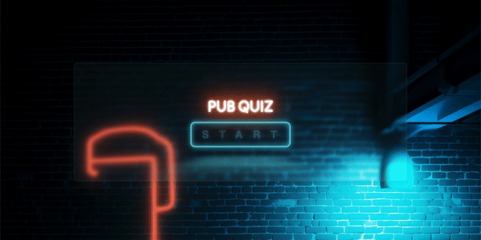

<div align="center">
  
</div>
<br>
<br>

# Pub Quiz 🍻
Dive into the excitement of a pub quiz night right from the comfort of your browser with PubQuiz! Designed for instant enjoyment during game nights with friends, PubQuiz brings the classic trivia experience to your fingertips. Simply open it up in your browser, gather your friends, and let the trivia fun begin!

<br>

## Current Version
PubQuiz is a dynamic online quiz platform crafted with Sinatra, a lightweight Ruby web application framework. Leveraging Sinatra's simplicity and efficiency, PubQuiz delivers a seamless technical experience, ensuring a hassle-free trivia adventure every time you click open your browser. As an MVP, PubQuiz currently emphasises spontaneity and quick setup. The prototype system presents the users with questions and calculates their score based on their answers, presenting it to the user upon completion. Data is managed on the front-end (a constraint from the initial challenge) and is not persisted, getting cleared upon restarting the quiz..

<br>

## Future Features
Looking ahead, the goal is for a more immersive experience for users. Future updates may include features such as user logins, the ability to create custom quizzes, session management, player invitations, teams and interactive scoreboards. PubQuiz aims to evolve into more than just a trivia platform — it's a streamlined hub where friends can unite, create, and enjoy trivia in a way that suits their unique preferences.

<br>
<br>

## How To Run
<br>

As this project is in Ruby, you need to make sure you have Ruby installed. You can run the command below, which should return the version of Ruby if you have it installed.
```
ruby -v
```
<br>
<br>

Create a new folder to clone the project in. For instance:
```
mkdir ~/$GITHUB_USERNAME/pub-quiz-sinatra
cd ~/$GITHUB_USERNAME/pub-quiz-sinatra
```
<br>
<br>

Clone the project repository.
```
git clone git@github.com:gulces/pub-quiz-sinatra.git
```
<br>
<br>

Make sure you have the [bundler](https://bundler.io/) gem installed.
```
gem install bundler
```
<br>
<details>
  <summary>    💡 Troubleshooting: If you run into any problems at this step refer here for a possible solution.</summary>
<br>
  
  ## Gem Installation Error

If you encounter the following error:

```
Fetching bundler-2.2.28.gem
ERROR:  While executing gem ... (Gem::FilePermissionError)
    You don't have write permissions for the /Library/Ruby/Gems/2.6.0 directory.
```
<br>

This might indicate that you don't have the necessary permissions to write to the directory where RubyGems is trying to install the bundler gem. This is a common issue when installing gems on a system-wide Ruby installation, and it typically requires administrator or superuser privileges.
<br>
<br>

Instead of modifying system directories, consider using a gem environment to manage your Ruby dependencies.
<br>
<br>

#### 1. Create and navigate to a directory for your gem environment

```
mkdir ~/my_ruby_gems
cd ~/my_ruby_gems
```
<br>

#### 2. Set the GEM_HOME and GEM_PATH environment variables to point to your new gem environment:

```
export GEM_HOME=$PWD
export GEM_PATH=$PWD
```
<br>

#### 3. You can now install gems, and they will be installed in the isolated environment without interfering with your system-wide Ruby installation or other gem environments.

```
gem install bundler
```
<br>
Remember that these environment variables are only set for the current terminal session. If you close the terminal or open a new one, you'll need to set these variables again if you want to work in the same isolated gem environment.
<br>
<br>
    
---

</details>
<br>
<br>

To install the dependencies, run this command in the root directory of the project:
```
bundle install
```
<br>
<br>

To run the project, enter this line in the terminal:
```
ruby app.rb
```
<br>

You can open your browser and go to [localhost:4567](localhost:4567) to start the pub quiz!
<br>
<br>

## Reflection
This project kicked off as a coding challenge, pushing the boundaries of my skill set at the time. Despite the learning curve, I embraced the challenge, turning theory into practice.

<br>

Fast forward to the present — my friends inspired me to see potential here. We were craving something between casual chatter and an all-out board game for when we get together, and that's in essence the spirit of a pub quiz. So, I envisioned Pub Quiz (a more clever branding TBD) as the perfect modern supplement to social occasions, striking a balance between engaging conversations and light-hearted gaming.

<br>

Upon revisiting the project, I dedicated time to polish its design and broaden its scope beyond the original challenge. Although the code was already functional, fine-tuning details and cleaning up my code made it more robust and scalable.

<br>

Looking ahead, I am enthusiastic about implementing future features. The general concept in mind involves two angles - a library of quizzes in various categories and a 'Create Your Own' function. For the former the idea would be a traditional trivia quiz, for the latter a group of users would be able to add each of their questions to a session, which would then be randomised so that nobody answers their own, leaning more towards a fun party game in that case.

<br>

Apart from a good laugh, the ability to add custom quizzes also opens up possibilities for diverse applications, from celebratory events like birthdays to weddings, where a personalised quiz could be a wholesome surprise. Exploring features such as teams and participants, I aim to conceptualise engagement without tethering everyone to their screens, which is an important consideration. For user authentication, I plan to revisit my Rails education, exploring robust frameworks from past group projects.

<br>

The evolution of this project reflects not only technical growth but also a deeper understanding of its potential in the real world. It is a testament to the joy of continuous learning and the exciting prospects ahead.

<br>

## Thank You
Thank you for visiting Pub Quiz and hope you enjoyed this project. If you have any questions or need further assistance, you can reach out to me, Gülce, at [gulcesakallioglu@gmail.com]. 
